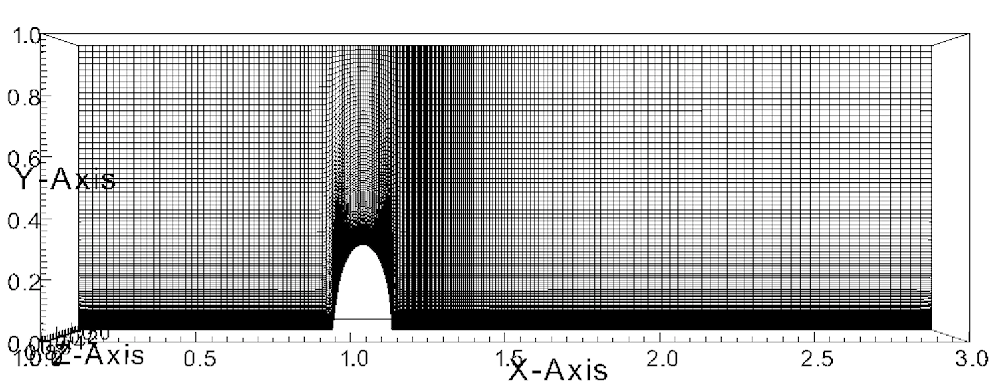
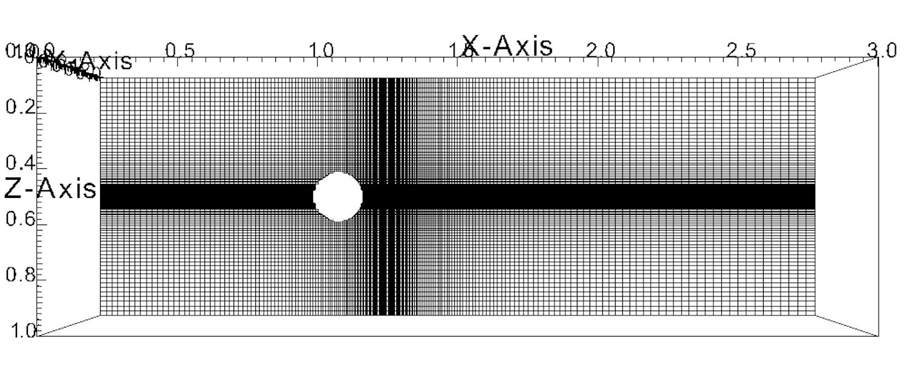

# Elliptic mesh generator for 3D geometries

## Final mesh images

## Image 2

## Compilation and running

`mpicxx -std=c++14 EllipticMeshGenerator.cpp -o out`  
`./out`

## Inputs
The input geometry is user defined. This example consists of a half-ellipsoid.

## Outputs
1. The code outputs a mesh `file_mesh.vtk` which is an ASCII VTK file of the structured mesh 
2. A `bc.dat` file which contains the boundary conditions for the bottom wall
3. Files `file_bc_wall.vtk` and `file_bc_farfield.vtk` which are vtk files to visualize 
the wall bc regions for the hump region vicinity

## Mesh stretching
Consider stretching in the x coordinate centered at a position `pos` (as a percentage of domain length from xmin). 
For the case of the ellipsoid, for eg., the center of the ellipsoid is at a $x=1.0$, and domain length is $3.0$. Hence 
$\mathrm{pos} = 0.333$ is an appropriate choice. The stretching is done using hyperbolic tangent functions as below  

$\xi = i/nx-1$, where `i` is the index  
$u1 = \mathrm{tanh}(\delta(1-\xi))(1-\mathrm{pos})$  
$u2 = \mathrm{pos}\times(2-\mathrm{tanh}(\delta\xi))$  
$\mathrm{fac} = 1-((u1+u2)-\mathrm{pos})$  
$x = \mathrm{xmin} + \mathrm{fac}\times(\mathrm{xmax}-\mathrm{xmin})$

## The smoothing algorithm
The elliptic governing equation is solved for the y coordinate to smooth the mesh. In this particular geoemtry, 
the x and z directions only need appropriate stretching and no smoothing is necessary. 

$\alpha_{11}\cfrac{\partial^2 y}{\partial \xi^2} + 2\alpha_{12}\cfrac{\partial^2 y}{\partial\xi\partial\eta} + 2\alpha_{13}\cfrac{\partial^2y}{\partial\xi\partial\zeta}+\alpha_{22}\cfrac{\partial^2y}{\partial\eta^2}+2\alpha_{23}\cfrac{\partial^2y}{\partial\eta\partial\zeta}+\alpha_{33}\cfrac{\partial^2y}{\partial\zeta^2} = 0$  

where  

$\alpha_{11} = a_{22}a_{33}-a^2_{23}$, $\alpha_{12}=a_{13}a_{23}-a_{12}a_{33}$, $\alpha_{13}=a_{12}a_{23}-a_{13}a_{22}$  
$\alpha_{22} = a_{11}a_{33}-a^2_{13}$, $\alpha_{23}=a_{13}a_{12}-a_{11}a_{23}$, $\alpha_{33}=a_{11}a_{22}-a^2_{12}$  

where `a`s are defined for eg. as 

$a_{12} = a_{\xi\eta} = \frac{\partial x}{\partial\xi}\frac{\partial x}{\partial\eta} + \frac{\partial y}{\partial \xi}\frac{\partial y}{\partial\eta}$
$+ \frac{\partial z}{\partial \xi}\frac{\partial z}{\partial\eta}$  

The derivatives are approximated using second-order finite differences, and an iterative Gauss-Siedel approach is used to solve the elliptic pde.

